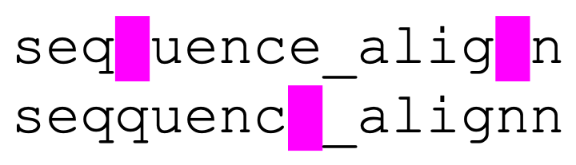
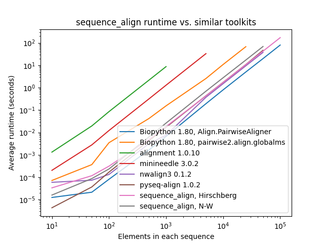
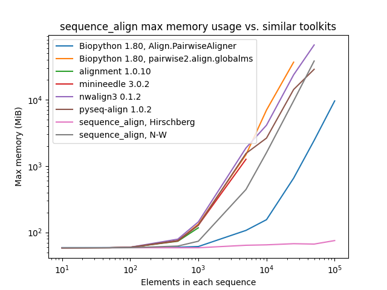

  <a href="https://github.com/kensho-technologies/sequence_align/actions?query=workflow%3A%22Tests+and+lint%22"></a>
  <a href="https://codecov.io/gh/kensho-technologies/sequence_align"></a>
  <a href="https://opensource.org/licenses/Apache-2.0"></a>
  <a href="http://www.repostatus.org/#active"></a>
  <a href="https://github.com/psf/black"></a>

# sequence_align
Efficient implementations of [Needleman-Wunsch](https://en.wikipedia.org/wiki/Needleman%E2%80%93Wunsch_algorithm)
and other sequence alignment algorithms written in Rust with Python bindings via [PyO3](https://github.com/PyO3/pyo3).

<p></p>

## Installation
`sequence_align` is distributed via PyPi for Python 3.7+, making installation as simple as the following --
no special setup required for cross-platform compatibility, Rust installation, etc.!

``` bash
pip install sequence_align
```

Alternatively, if one wishes to develop for `sequence_align`, first ensure that both
[Python](https://wiki.python.org/moin/BeginnersGuide/Download) and [Rust](https://www.rust-lang.org/tools/install)
are installed on your system. Then, install [Maturin](https://www.maturin.rs/#usage) and run
`maturin develop` (optionally with the `-r` flag to compile a release build, instead of an unoptimized debug build)
from the root of your cloned repo to build and install `sequence_align` in your active Python environment.

## Quick Start
`sequence_align` is distributed via [PyPi](https://pypi.org/project/sequence_align/) for Python 3.7+,
making installation as simple as the following -- no special setup required for cross-platform compatibility, Rust installation, etc.!

``` bash
pip install sequence_align
```

Pairwise sequence algorithms are available in [sequence_align.pairwise](src/sequence_align/pairwise.py).
Currently, two algorithms are implemented: the [Needleman-Wunsch algorithm](https://en.wikipedia.org/wiki/Needleman%E2%80%93Wunsch_algorithm)
and [Hirschberg’s algorithm](https://en.wikipedia.org/wiki/Hirschberg%27s_algorithm). Needleman-Wunsch is
commonly used for global sequence alignment, but suffers from the fact that it uses `O(M*N)` space,
where `M` and `N` are the lengths of the two sequences being aligned. Hirschberg’s algorithm modifies Needleman-Wunsch
to have the same time complexity (`O(M*N)`), but only use `O(min{M, N})` space, making it an appealing option
for memory-limited applications or extremely large sequences.

Using these algorithms is straightforward:

``` python
from sequence_align.pairwise import hirschberg, needleman_wunsch


# See https://en.wikipedia.org/wiki/Needleman%E2%80%93Wunsch_algorithm#/media/File:Needleman-Wunsch_pairwise_sequence_alignment.png
# Use Needleman-Wunsch default scores (match=1, mismatch=-1, indel=-1)
seq_a = ["G", "A", "T", "T", "A", "C", "A"]
seq_b = ["G", "C", "A", "T", "G", "C", "G"]

aligned_seq_a, aligned_seq_b = needleman_wunsch(
    seq_a,
    seq_b,
    match_score=1.0,
    mismatch_score=-1.0,
    indel_score=-1.0,
    gap="_",
)

# Expects ["G", "_", "A", "T", "T", "A", "C", "A"]
print(aligned_seq_a)

# Expects ["G", "C", "A", "_", "T", "G", "C", "G"]
print(aligned_seq_b)


# See https://en.wikipedia.org/wiki/Hirschberg%27s_algorithm#Example
seq_a = ["A", "G", "T", "A", "C", "G", "C", "A"]
seq_b = ["T", "A", "T", "G", "C"]

aligned_seq_a, aligned_seq_b = hirschberg(
    seq_a,
    seq_b,
    match_score=2.0,
    mismatch_score=-1.0,
    indel_score=-2.0,
    gap="_",
)

# Expects ["A", "G", "T", "A", "C", "G", "C", "A"]
print(aligned_seq_a)

# Expects ["_", "_", "T", "A", "T", "G", "C", "_"]
print(aligned_seq_b)
```

## Performance Benchmarks
All tests below were conducted sequentially on a [AWS R5.4 instance](https://aws.amazon.com/ec2/instance-types/r5/)
with 16 cores and 128 GB of memory. The pair of sequences for alignment consist of a character sequence of randomly
selected A/C/G/T nucleotide bases along with another that is identical, except with 10% of the characters randomly
perturbed by deletion, insertion of another randomly-selected character after the entry, or replacement with a
different randomly-selected character.

As one can see, while `sequence_align` is comparable to some other toolkits in terms of speed, its memory performance
is **best-in-class**, even when compared to toolkits using the same algorithm, such as Needleman-Wunsch being used in
`pyseq-align`. 

_(Please note that some lines terminate early, as some toolkits took prohibitively long and/or ran out of memory at higher scales.)_

<p></p>

<p></p>

## License
Licensed under the Apache 2.0 License. Unless required by applicable law or agreed to in writing, software distributed under the License is distributed on an "AS IS" BASIS, WITHOUT WARRANTIES OR CONDITIONS OF ANY KIND, either express or implied. See the License for the specific language governing permissions and limitations under the License.

Copyright 2023-present Kensho Technologies, LLC. The present date is determined by the timestamp of the most recent commit in the repository.
